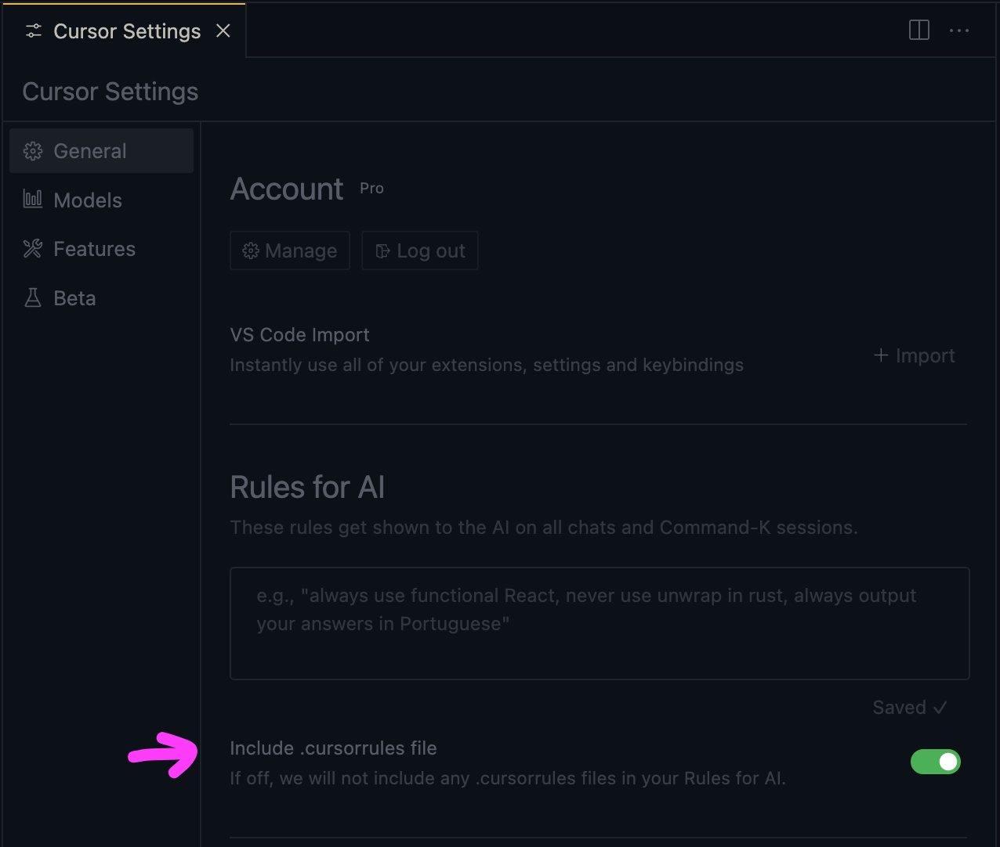
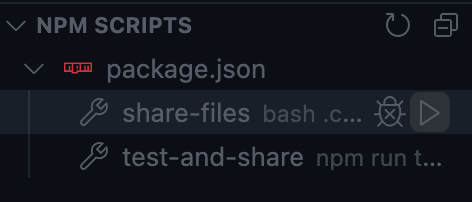

# Cursor AI Context Generator

This repository serves as a reference for setting up a context generation system for the Cursor AI IDE. It demonstrates how to create a comprehensive output file containing your project's context, enabling faster iterations and a better experience with Cursor AI.

## Overview

The main components of this setup are:

1. `.cursorcontext.sh`: A bash script that generates the context file
2. `.cursorrules`: A configuration file for custom rules and patterns
3. `package.json`: Contains npm scripts for easy execution

## How It Works

The `.cursorcontext.sh` script:

1. Creates a single output file (`x.md`) in the `docs` directory
2. Generates a project structure tree
3. Includes debug information and important file paths
4. Adds the contents of `.cursorrules`
5. Incorporates log files (build, test, lint, coverage) if they exist
6. Includes the contents of `package.json`
7. Adds the contents of all relevant source and test files

The generated `x.md` file can then be used to provide comprehensive context to Cursor AI IDE.

## Cursor Rules

The `.cursorrules` file contains a set of rules that guide the behavior of the AI assistant. These rules help maintain consistency and avoid common pitfalls in AI-assisted development.



The rules cover various aspects such as:

- Verifying information
- Making file-by-file changes
- Avoiding unnecessary apologies or confirmations
- Preserving existing code structures
- Providing concise and relevant responses

These rules ensure that the AI assistant provides helpful and accurate assistance while respecting the project's existing structure and the developer's intentions.

## NPM Scripts

The `package.json` file includes scripts that make it easy to run the context generation process:



- `npm run share-files`: Runs the `.cursorcontext.sh` script to generate the context file
- `npm run test-and-share`: Runs tests (if configured) and then generates the context

These scripts simplify the process of generating and updating the context file, making it easier to keep your AI assistant up-to-date with your project's latest state.

## Customization

- Modify `.cursorcontext.sh` to include or exclude specific directories or file types
- Adjust `.cursorrules` to add custom rules and patterns for your project
- Update `package.json` scripts as needed for your workflow

## Usage

To use this setup in your own project:

1. Copy `.cursorcontext.sh`, `.cursorrules`, and the relevant `package.json` scripts to your project
2. Customize the variables at the top of `.cursorcontext.sh` as needed
3. Run the context generation script using:

   ```bash
   npm run share-files
   ```

4. Use the generated `docs/x.md` file with Cursor AI IDE

## Note

This is a reference implementation and may need adjustments to work with your specific project structure and needs. It's provided as-is, without any guarantees, and is free to use and modify.

## Author

Bruno Palma

## License

[MIT License](LICENSE)
